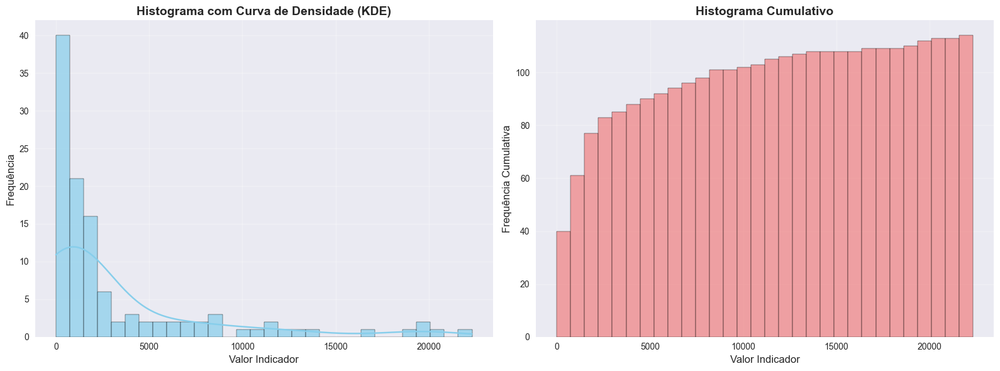

# 📊 Análise de Dados em Saúde Pública - Região do Cariri
### Exames Citopatológicos e Mamografia no Ceará


---

## 🎯 Sobre o Projeto

Este projeto realiza uma análise exploratória de dados (EDA) aplicada à saúde pública na região do Cariri - Ceará, com foco em:

- 🧪 Exames citopatológicos (Papanicolau) em mulheres (25–64 anos)
- 🩺 Exames de mamografia em mulheres (50–69 anos)

O objetivo é identificar **padrões, desigualdades regionais, tendências temporais e estabelecer benchmarks** para avaliação da efetividade dos programas de rastreamento de câncer.

---

## 📁 Estrutura do Projeto

```
ANALISEDADOSCANCERDEMAMA/
│
├── app/
│   ├── Artigo1.0.py
│   └── dashboard.py
│
├── Datasets/
│   ├── ccmec25a64_main.csv
│   ├── ccmec50a69.csv
│   ├── citopatologia_cariri.csv
│   ├── mamografia_cariri.csv
│   ├── cito_e_mamo_cariri.csv
│   ├── dados_tratados.csv
│   └── df_limpo_sem_outliers.csv
│
├── Documentação/
│   ├── Artigo_Previne_Brasil.pdf
│   ├── OBSERVAÇÕES.txt
│   └── RoteiroTrabalho.pdf
│
├── Notebooks/
│   ├── N1/
│   │   ├── Notebook1.ipynb
│   │   ├── Notebook2.ipynb
│   │   ├── Notebook3.ipynb
│   │   ├── Notebook5.ipynb
│   │   ├── Notebook6.ipynb
│   │   └── analise_cruzada_exames_hospitais.png
│   └── N2/
│       └── rascunhos.ipynb
│
├── README.md
└── requirements.txt
```

---

## 📊 Principais Análises

### 📌 1. Limpeza e Filtragem de Dados (Notebook5.ipynb)
- Filtragem para região do Cariri - Ceará (28 municípios)
- Remoção de valores inconsistentes (zeros)
- Unificação de datasets de citopatologia e mamografia
- Criação de datasets limpos: `citopatologia_cariri.csv`, `mamografia_cariri.csv`, `cito_e_mamo_cariri.csv`

💡 **Insight:**
Preparação dos dados para análise focada na região do Cariri, tratando inconsistências como subnotificação e dados tardios.

---

### 📌 2. Estatísticas Descritivas (Notebook6.ipynb)
- Medidas de posição: média, mediana, moda, percentis
- Medidas separatrizes: quartis, decis
- Análise de distribuição por município, UF e Brasil

💡 **Insight:**
Municípios apresentam alta variabilidade, com assimetria à direita indicando concentração de valores baixos.

---

### 📌 3. Detecção de Outliers

- **Notebook5:** Remoção de valores inconsistentes (zeros) e filtragem para região do Cariri - Ceará (28 municípios), resultando em datasets limpos sem registros nulos ou inválidos.
- **Notebook6:** Método estatístico **IQR (Intervalo Interquartil)** aplicado ao dataset filtrado do Cariri.

| Etapa | Registros |
|------|---------:|
| Antes (Notebook6) | 5986 |
| Depois (Notebook6) | 4257 |
| Removidos (Notebook6) | 1729 |

💡 **Resultado:**  
Redução de distorções no dataset do Cariri, melhorando a qualidade das análises estatísticas.

---

### 📌 4. Dispersão dos Dados

Análise focada na região do Cariri (Ceará), com níveis específicos:

| Nível | CV (%) | Interpretação |
|------|------:|-------------|
| Municípios (Cariri) | 953% | Extremamente heterogêneo |
| UF (Ceará) | 101% | Moderado |
| Brasil (agregado) | 15% | Estável |

💡 **Nota:**  
Os cálculos consideram apenas os dados filtrados para o Cariri, onde "UF" refere-se ao Ceará e "municípios" aos 28 do Cariri.

### 📌 5. Análise Temporal

- Filtragem por períodos específicos
- Comparação de tendências ao longo do tempo

💡 **Insight:**
Identificação de variações temporais nos exames realizados.

---

### 📌 6. Benchmarks de Saúde

Comparação com padrões internacionais (OMS/INCA):

- Cobertura recomendada para exames de rastreamento
- Indicadores de efetividade dos programas

💡 **Objetivo:**
Avaliar se os dados atendem aos benchmarks estabelecidos para prevenção de câncer.

---

## 📉 Visualizações

O projeto inclui:

- Histogramas
- Boxplots
- Gráficos de dispersão
- Gráficos de barras
- Análise comparativa entre regiões

📍 Exemplo:



---

## ⚠️ Limitações

- Dados secundários (SUS)
- Possível subnotificação
- Falta de dados clínicos e socioeconômicos
- Cobertura desigual entre regiões

---

## 🧠 Conclusões

✔ Dataset hierárquico e heterogêneo
✔ Alta variabilidade em municípios
✔ Dados agregados mais estáveis
✔ Remoção de outliers essencial
✔ Benchmarks fornecem contexto para avaliação

---

## 🚀 Próximos Passos

- 📊 Dashboard interativo (Streamlit)
- 🗺️ Mapas geográficos
- 🤖 Modelos preditivos
- 📈 Análise temporal avançada

---

## 🛠️ Tecnologias

- Python
- Pandas
- NumPy
- Matplotlib
- Seaborn
- SciPy

---

## ▶️ Como Executar

```bash
pip install -r requirements.txt
```

## 👨‍💻 Autor

Projeto desenvolvido para disciplina de Estatística Computacional
com foco em análise de dados aplicada à saúde pública.

## ⭐ Destaque

Este projeto demonstra:

✔ Limpeza e tratamento de dados <br>
✔ Análise estatística completa <br>
✔ Detecção de outliers <br>
✔ Visualização de dados <br>
✔ Estabelecimento de benchmarks