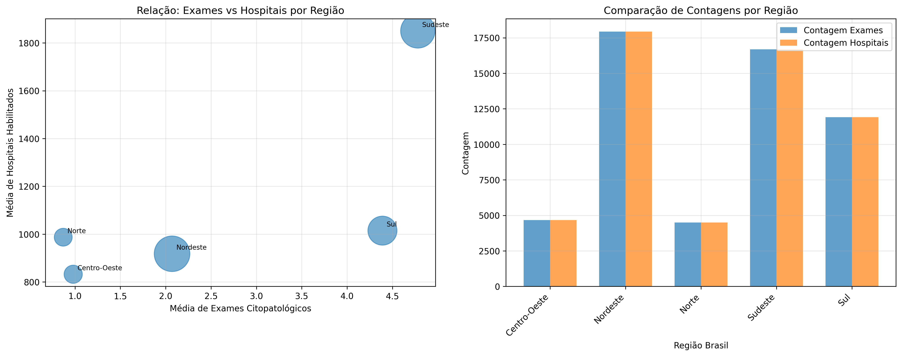

<<<<<<< HEAD
# � Análise de Dados em Saúde Pública - Mamografia e Citopatologia

Projeto desenvolvido para a disciplina de Estatística Computacional, com foco em análise exploratória, visualização e interpretação de dados relacionados a exames de mamografia e citopatologia no Ceará, especialmente nas regiões do Cariri e de Crajubar.


---

## 🎯 Objetivo do projeto

Este repositório reúne uma coleção de análises, notebooks e recursos visuais para:

- explorar indicadores de saúde pública relacionados a exames de mamografia e citopatologia;
- comparar padrões por município, faixa etária e etnia;
- aplicar técnicas de limpeza, tratamento e visualização de dados;
- gerar relatórios, gráficos e interpretações para apoiar a apresentação dos resultados.

A proposta é organizar o trabalho em etapas de análise, com foco em compreender a distribuição dos exames, possíveis desigualdades regionais e a consistência dos indicadores disponíveis nas bases de dados.

---

## 📁 Estrutura do projeto

```text
AnaliseDadosCancerDeMama/
├── app/
│   ├── Artigo1.0.py
│   └── dashboard.py
├── Datasets/
│   ├── N1/
│   └── N2/
├── Documentação/
│   └── OBSERVAÇÕES.txt
├── Notebooks/
│   ├── N1/
│   └── N2/
├── requirements.txt
└── README.md
```

### Descrição dos diretórios

- app/: scripts auxiliares e protótipos de dashboard.
- Datasets/: arquivos CSV utilizados nas análises, organizados por etapa N1 e N2.
- Documentação/: materiais complementares e observações do projeto.
- Notebooks/: notebooks com a análise exploratória, limpeza, visualização e interpretação dos dados.

---

## 📊 O que está sendo analisado

O trabalho utiliza bases sobre:

- exames de mamografia;
- exames citopatológicos;
- recortes por município;
- distribuição por faixa etária;
- distribuição por grupo étnico;
- comparação entre o total geral e os recortes específicos.

As análises estão organizadas na pasta Notebooks, com foco em estatística descritiva, visualização de dados e interpretação dos resultados.

---

## 🧪 Ferramentas e tecnologias

As principais ferramentas utilizadas no projeto são:
=======
# 📊 Análise de Dados em Saúde Pública  
### Exames Citopatológicos e Infraestrutura Oncológica no Brasil


---

## 🎯 Sobre o Projeto

Este projeto realiza uma análise exploratória de dados (EDA) aplicada à saúde pública brasileira, com foco em:

- 🧪 Exames citopatológicos (Papanicolau) em mulheres (25–64 anos)  
- 🏥 Hospitais habilitados para tratamento de câncer  

O objetivo é identificar **padrões, desigualdades regionais e possíveis gargalos no sistema de saúde**.

---

## 📁 Estrutura do Projeto

```
ANALISEDADOSCANCERDEMAMA/
│
├── app/
│   ├── Artigo1.0.py
│   └── dashboard.py
│
├── Datasets/
│   ├── ccmec25a64_main.csv
│   ├── ccmhhcac.csv
│   ├── dados_tratados.csv
│   └── df_limpo_sem_outliers.csv
│
├── Documentação/
│   ├── Artigo_Previne_Brasil.pdf
│   ├── OBSERVAÇÕES.txt
│   └── RoteiroTrabalho.pdf
│
├── Notebooks/
│   ├── N1/
│   │   ├── Notebook1.ipynb
│   │   ├── Notebook2.ipynb
│   │   ├── Notebook3.ipynb
│   │   ├── Notebook4.ipynb
│   │   └── analise_cruzada_exames_hospitais.png
│   └── N2/
│
├── README.md
└── requirements.txt
```


---

## 📊 Principais Análises

### 📌 1. Estatísticas Descritivas
- Média, mediana e moda  
- Percentis (P10 → P95)  
- Variância e desvio padrão  
- Coeficiente de variação  

💡 **Insight:**  
Municípios apresentam **altíssima variabilidade**, enquanto o Brasil mostra estabilidade.

---

### 📌 2. Distribuição dos Dados

- 📉 Histogramas  
- 📦 Boxplots  
- 📈 Curvas CDF  

💡 **Insight:**  
- Municípios → forte assimetria (cauda longa)  
- UF → comportamento intermediário  
- Brasil → distribuição equilibrada  

---

### 📌 3. Detecção de Outliers

- Método: **IQR (Intervalo Interquartil)**  

| Etapa | Registros |
|------|---------:|
| Antes | 5986 |
| Depois | 4257 |
| Removidos | 1729 |

💡 **Resultado:**  
Redução significativa de distorções estatísticas.

---

### 📌 4. Dispersão dos Dados

| Nível | CV (%) | Interpretação |
|------|------:|-------------|
| Municípios | 953% | Extremamente heterogêneo |
| UF | 101% | Moderado |
| Brasil | 15% | Estável |

---

### 📌 5. Análise Cruzada

Comparação entre:

- Número de exames realizados  
- Quantidade de hospitais disponíveis  

💡 **Objetivo:**  
Identificar possíveis desigualdades entre **demanda e infraestrutura de saúde**.

---

## 📉 Visualizações

O projeto inclui:

- Histogramas
- Boxplots
- Gráficos de dispersão
- Gráficos por UF
- Análise comparativa entre regiões

📍 Exemplo:



---

## ⚠️ Limitações

- Dados secundários (SUS)
- Possível subnotificação
- Falta de dados clínicos e socioeconômicos
- Cobertura desigual entre regiões

---

## 🧠 Conclusões

✔ O dataset é **hierárquico e heterogêneo**  
✔ Municípios apresentam alta variabilidade  
✔ Dados agregados (UF/Brasil) são mais estáveis  
✔ Remoção de outliers foi essencial para qualidade da análise  

---

## 🚀 Próximos Passos

- 📊 Dashboard interativo (Streamlit)
- 🗺️ Mapas geográficos
- 🤖 Modelos preditivos
- 📈 Análise temporal avançada

---

## 🛠️ Tecnologias
>>>>>>> 9224d1b566ecc472a8734d6a26e2be8a2bbf306b

- Python
- Pandas
- NumPy
- Matplotlib
- Seaborn
<<<<<<< HEAD
- Plotly
- Streamlit

O arquivo requirements.txt reúne as dependências básicas para reproduzir as análises.

---

## ▶️ Como executar

1. Crie um ambiente virtual:

   ```bash
   python -m venv .venv
   source .venv/bin/activate   # Linux/macOS
   .\.venv\Scripts\activate    # Windows
   ```

2. Instale as dependências:

   ```bash
   pip install -r requirements.txt
   ```

3. Abra os notebooks em Jupyter ou VS Code para executar as análises.

4. Para visualizar o dashboard, execute:

   ```bash
   streamlit run app/dashboard.py
   ```

---

## 📌 Notebooks principais

A pasta Notebooks contém a sequência de análises do projeto, incluindo:

- contexto e introdução;
- análise inicial dos dados;
- limpeza e filtragem;
- estatística descritiva;
- comparação por etnia e faixa etária;
- visualizações e relatórios.

Esses notebooks formam a base da análise e também servem como material de apresentação e revisão do trabalho.

---

## 📈 Resultados esperados

Com este projeto, espera-se:

- organizar e padronizar os dados de saúde pública;
- identificar padrões e diferenças entre grupos e regiões;
- gerar visualizações que facilitem a leitura dos resultados;
- construir uma base consistente para relatórios e apresentações acadêmicas.

---

## ⚠️ Observações importantes

- Os dados utilizados são baseados em fontes públicas e já tratadas para fins de análise.
- Algumas etapas podem depender da estrutura local dos arquivos CSV.
- O projeto está em evolução e pode receber ajustes conforme a análise avança.

---

## 👩‍💻 Autor

Projeto desenvolvido como parte da disciplina de Estatística Computacional, com foco em análise exploratória aplicada à saúde pública.

---

## ✅ Resumo

Este repositório reúne uma análise de dados aplicada à saúde pública, com atenção especial à organização, visualização e interpretação dos resultados. A estrutura do projeto foi atualizada para melhor refletir o que está sendo desenvolvido e como navegar pelos materiais disponíveis.
=======
- SciPy

---

## ▶️ Como Executar

```bash
pip install -r requirements.txt
```

## 👨‍💻 Autor

Projeto desenvolvido para disciplina de Estatística S4
com foco em análise de dados aplicada à saúde pública.

## ⭐ Destaque

Este projeto demonstra:

✔ Análise estatística completa <br>
✔ Limpeza e tratamento de dados <br>
✔ Detecção de outliers <br>
✔ Visualização de dados <br>
✔ Interpretação orientada a negócio
>>>>>>> 9224d1b566ecc472a8734d6a26e2be8a2bbf306b
